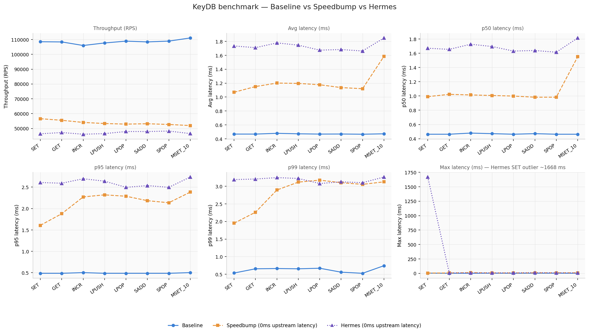
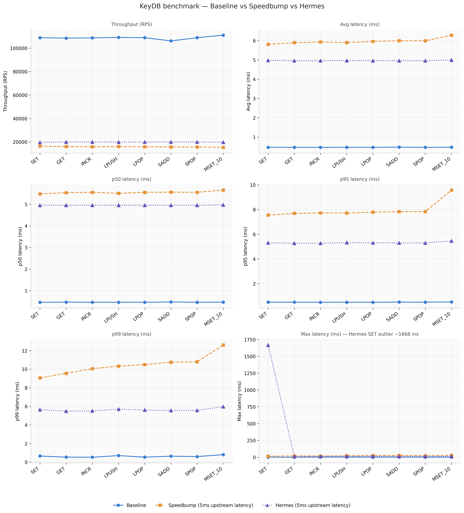

# Intro

**Hermes** is a TCP proxy written in Erlang that simulates network conditions between servers. It introduces configurable latency by delaying data forwarding on each send operation, where each operation transmits up to one buffer's worth of data. Similar to **kffl/speedbump** (written in Go), Hermes supports runtime delay injection via an HTTP API.

# Benchmarks

## redis-benchmark

Benchmarking script is available at `benchmarks/redis_test.sh`. The following benchmarking results are based on `1M` requests across `100` concurrent clients with buffer size `65536` (64 KB) across different latencies.

### Baseline (without any proxy) vs Speedbump (0ms upstream latency) vs Hermes (0ms upstream latency)

   


### Baseline (without any proxy) vs Speedbump (5ms upstream latency) vs Hermes (5ms upstream latency)

   

# Docker compose setup (recommended)

```sh
services:
  hermes:
    image: xillar/hermes:latest
    container_name: hermes
    ports:
      - "6389:6389"
    environment:
      LISTEN_HOST: "0.0.0.0"
      LISTEN_PORT: "6389"
      FORWARD_HOST: "localhost"
      FORWARD_PORT: "6379"
      LATENCY_MSECS: "${LATENCY_MSECS:-5}"
      BUFFER_SIZE: "4096"
      LOG_LEVEL: "INFO"
      API_HOST: "0.0.0.0"
      API_PORT: "8000"
```

Docker public image: `xillar/hermes:latest`

  ## Configuration (Environment Variables)
  
  The proxy is configured using environment variables. Below are the available options:
  
  ### Core Settings
  
  - **`LISTEN_HOST`** *(default: `127.0.0.1`)*  
    IP address the proxy binds to for incoming connections.  
  
  - **`LISTEN_PORT`** *(default: `6380`)*  
    Port the proxy listens on.  
  
  - **`FORWARD_HOST`** *(default: `127.0.0.1`)*  
    Target server IP address where traffic is forwarded (e.g., Redis/KeyDB instance).  
  
  - **`FORWARD_PORT`** *(default: `6379`)*  
    Target server port.  

  - **`BUFFER_SIZE`** *(default: `65536`)*  
    Size (in bytes) of each read operation from the socket.  
    Larger values may improve throughput, while smaller values can provide finer-grained latency control.

  - **`API_HOST`** *(default: `127.0.0.1`)*  
    Latency API host address.  
  
  - **`API_PORT`** *(default: `8000`)*  
    Latency API port.
  
  ### Latency Control
  
  - **`LATENCY_MSECS`** *(default: `0`)*  
    Artificial delay (in milliseconds) applied to each packet.  
  

# API documentation

## Read current Latency in Milliseconds

Request:
```sh
curl -X GET http://<API_HOST>:<API_PORT>/latency
curl -X GET http://localhost:8000/latency  # example
```

Response:
```sh
{"latency": 5}
```

## Update current Latency in Milliseconds

Request to update proxy latency to `20ms`:

```sh
curl -X POST http://localhost:8000/latency  \
     -H 'Content-Type: application/json' \
     -d '{"latency": 20}'
```

Response:
```sh
{"latency":20}
```

# Acknowledgments

This project was developed with assistance from AI tools, including:

- **Claude (Anthropic)** – for code suggestions, design ideas, and implementation guidance  
- **OpenAI (ChatGPT)** – for code development, debugging help, and README/documentation improvements  

These tools were used to accelerate development and improve code quality and clarity.
